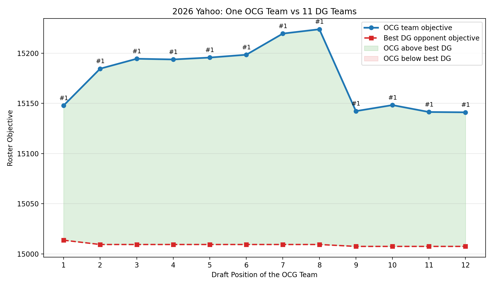
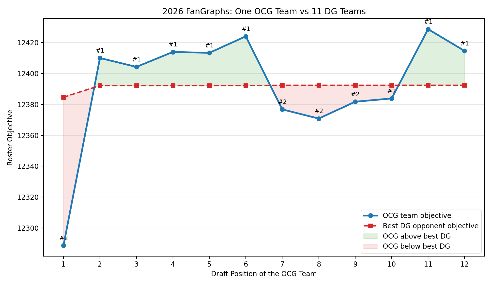

<!-- _class: title-slide -->

# Algorithmic Roster Construction
## Strategic Talent Acquisition under Competitive Scarcity
### A Fantasy Baseball Testbed for Real-Time Draft Optimization

  <strong>OR114-2 Final Project, Group 4</strong> 
  B13705051 Chou, Meng-Cheng | B13902103 Cheng, Yu-Hung | B13303153 Chan, Shu-Yu | B11705039 Lee, Ying-Ying 

<!--
Presenter notes:
Hi everyone. Today, we will present our project, **Algorithmic Roster Construction**.

Specifically, we study a sequential decision-making problem where a manager must acquire talent under strict constraints and intense market competition.

We use Fantasy Baseball not as the final application itself, but as a data-rich competitive testbed for studying sequential talent acquisition under scarcity. It gives us real market expectations, projected player utility, and a timed draft environment where opportunity cost matters.
-->
---
## 1. Introduction: The Road to the 2026 Season

**Drafts are the foundation of MLB team building which require superior winning strategies.**

- **The Front Office Focus**
    The duty of professional GMs.
- **The Global Fanbase**
  Through **Fantasy Baseball** such online games, millions of fans engage in the same mathematical puzzle.

  

---

## 2. Motivation: Importance and Challenge

  
Strategic Complexity

  <ul>
    <li><b>Roster Composition</b>: 
      a balanced / "M-Shaped" roster?</li>
    <li><b>Market Volatility</b>:   How to react when opponents "snipe" the planned targets?</li>
  </ul>

  
Combinatorial Explosion

  <ul>
    <li>More than <b>12</b> teams & <b>1,000+ players</b> in the pool.</li>
    <li><b>16 Roster Slots</b> per team with rigid position constraints.</li>
    <li><b>Real-time Pressure</b>: Most decisions must be made in <b>60 seconds</b>.</li>
  </ul>

> **Problem**: Humans cannot mentally process hundreds of Alternative Plans A, B, C... in real-time. We need a scalable **Decision Support System**.

<!--
Presenter notes:
In simple terms, this is a step-by-step talent selection problem in a competitive market.

Technically, we model it as sequential resource allocation under scarcity. Multiple decision makers compete for a limited pool of unique players, and every opponent's pick changes the feasible set for everyone else.

A manager must balance roster requirements with the timing paradox: knowing when to secure a scarce asset before its market availability expires.

So our goal is to build a decision-support framework that provides a deployable balance between theoretical optimality and real-time execution speed.
-->
---
<!-- _class: impact-slide -->

# Problem Settings

<!--
Presenter notes:
Next, we introduce the problem settings of our model.

We first define the information available for each player, then explain the snake draft mechanism, and finally describe the roster requirements that every valid team must satisfy.
-->
---
## 2. Problem Settings I: Player Attributes

Each player in the draft pool is defined by three key attributes:

**1. Value Proxy ($v_i$)**: Consensus projected utility for each player

  <h3 style="margin-top:0;">Convergence of Analytics</h3>
  Team evaluations of players converges as scouting becomes more data-driven.  
⇒ Value standardization.

**2. Average Draft Position (ADP)**: Market expectation / availability window

  <h3 style="margin-top:0;">Market Game Theory</h3>
  GMs know that after a certain pick, a player is unlikely to remain available.  

 

**3. Eligible Positions ($E_i$)**: The structural roster slots a player can occupy.

<!--
Presenter notes:
To model sequential talent acquisition, each player has three attributes.

First is the Value Proxy, \(v_i\), representing consensus projected utility. Second is ADP, or Average Draft Position. This serves as a market expectation proxy, telling us how long an asset is likely to remain available. Finally, eligibility defines where a player fits into the roster's structural constraints.

So \(v_i\) tells us expected utility, ADP tells us timing risk, and eligibility tells us whether the asset fits the roster structure.
-->
---
## 3. Problem Settings II: Snake Draft Mechanism

While the MLB uses a fixed-order draft based on the previous year's record, we utilize a **"Snake Draft"** mechanism to focus purely on **strategic optimization**.

- **Why and What is Snake Draft?**
  The order reverses every round (1-2-3, 3-2-1), which eliminates the absolute resource advantage of the first pick. The mechanism is also utilized in the game Fantasy Baseball.
- **Mathematical Slot Mapping**:
  For $M$ managers and our initial pick $j$ ($1 \le j \le M$), our absolute pick $k$ in round $r$ is:
  - **Odd Rounds (Forward)**: $k = (r - 1)M + j$
  - **Even Rounds (Reverse)**: $k = rM - j + 1$

<!--
Presenter notes:
Next, we define the draft environment.

We use a snake draft, which reverses the order every round. If round one is 1, 2, 3, then round two is 3, 2, 1. This reduces the absolute advantage of the first pick and makes timing strategy more important.

The equations convert the round number and initial position into the absolute pick number, so we know exactly when our team drafts in each round.
-->
---
## 4. Problem Settings III: Roster Requirements

A valid team must strictly satisfy specific roster constraints shown below:

**The 16-slot starting lineup**

| Position | C | 1B | 2B | 3B | SS | OF | Util | SP | RP |
| :--- | :---: | :---: | :---: | :---: | :---: | :---: | :---: | :---: | :---: |
| **Required Slots** | 1 | 1 | 1 | 1 | 1 | 3 | 1 | 5 | 2 |

*Note: The **Util (Utility)** slot is restricted to hitters only. (pitchers cannot fill the spot!)*

<!--
Presenter notes:
A valid draft must satisfy roster requirements.

We use a 16-slot starting lineup: infield positions, three outfielders, one hitter-only utility slot, five starting pitchers, and two relief pitchers.

This means the model cannot simply choose the highest-valued players. It must also fill every required position correctly. These roster requirements become hard constraints in the optimization model.
-->
---
<!-- _class: impact-slide -->

# Data Framework
## Consensus Projections & Market Expectations

<!--
Presenter notes:
After defining the draft environment, we transform the baseball market into a structured data framework.

For each player, we need a value proxy, a market availability proxy, and position eligibility. Fantasy Baseball is useful here because it provides a high-frequency market with consensus projections and observable draft expectations.
-->
---
#### 1. Value Proxy ($v_i$): Consensus Projected Utility
- Synthesized 2026 consensus projections from **FantasyPros**.
- Applied two scoring systems to test robustness across reward structures:

  
Yahoo Scoring

  <ul>
    <li><b>Batters</b>: (1B: 2.6, 2B: 5.2, 3B: 7.8, HR: 10.4, BB: 2.6, SB: 4.2, <b>R: 1.9, RBI: 1.9</b>)</li>
    <li><b>Pitchers</b>: (IP: 3, K: 3, SV: 8, H: -1.3, BB: -1.3, HBP: -1.3, <b>W: 8, ER: -3</b>)</li>
  </ul>

  
FanGraphs Scoring

  <ul>
    <li><b>Batters</b>: (H: 5.6, 2B: 2.9, 3B: 5.7, HR: 9.4, BB: 3, SB: 1.9, <b>AB: -1</b>)</li>
    <li><b>Pitchers</b>: (IP: 7.4, K: 2, SV: 5, H: -2.6, BB: -3, HBP: -3, <b>HR: -12.3, HLD: 4</b>)</li>
  </ul>

<!--
Presenter notes:
The first data component is the value proxy, \(v_i\).

We use 2026 FantasyPros consensus projections. The raw projections include batting and pitching statistics such as home runs, stolen bases, innings, strikeouts, saves, and wins.

However, these raw statistics cannot be used directly as objective values. We convert them into projected utility using league-specific scoring systems.

To test robustness, we use Yahoo and FanGraphs scoring. Because they assign different weights to the same events, the same player may have different utility under different reward structures.

By testing both systems, we check whether the decision framework performs consistently across different reward structures.
-->
---
#### 2. Market Availability Proxy (ADP)
- Aggregate ADP from **FantasyPros**, combining Yahoo, ESPN, CBS, and NFBC.
- Defines the **availability horizon** for each asset in the talent pool.

<!--
Presenter notes:
The second data component is Average Draft Position, or ADP.

We collected aggregate ADP from FantasyPros, combining information from platforms such as Yahoo, ESPN, CBS, and NFBC.

ADP is important because it represents the market's expectation of when each player will be drafted. In our model, it defines the availability horizon of each asset.

For example, if a player's ADP is much earlier than our next pick, then we should not assume that player will still be available. This makes the model more realistic than simply ranking players by projected points.
-->
---
<!-- _class: impact-slide -->

# Model Formulation

<!--
Presenter notes:
Now we move from data to mathematical modeling.

Using projected value, ADP, and position eligibility, we formulate the draft problem as an integer programming model. The IP model gives us a benchmark for the best possible roster under our assumptions.
-->
---
## 5. Model Formulation I: Variables and Objective

Using $v_i$ and $\text{adp}_i$, we construct an **Integer Programming (IP)** model.
Let $I$ be the set of players, $P$ the set of positions, and $K$ the set of our draft picks.

**Decision Variables**:
- $y_i \in \{0,1\}$: if player $i$ is drafted.
- $x_{ip} \in \{0,1\}$: if player $i$ is assigned to position $p$.
- $z_{ik} \in \{0,1\}$: if player $i$ is selected at our $k$-th pick.

**Objective Function**: Maximize the total projected value of the starting roster.
$$ \max \sum_{i \in I} v_i y_i $$

<!--
Presenter notes:
In the IP model, we define three binary variables.

\(y_i\) indicates whether player \(i\) is drafted. \(x_{ip}\) assigns player \(i\) to position \(p\). \(z_{ik}\) records whether player \(i\) is selected at our \(k\)-th pick.

The objective is to maximize the total projected utility of the starting roster while satisfying all draft and roster constraints.
-->
---
## 6. Model Formulation II: Constraints

1. **Draft Logic & Roster Integrity**:
   $$
   \begin{alignedat}{3}
   \sum_{i \in I} z_{ik} &= 1 && \quad \forall k \in K && \quad \text{(One player per pick)} ; \\
   \sum_{k \in K} z_{ik} &= y_i && \quad \forall i \in I && \quad \text{(At most one pick per player)}
   \end{alignedat}
   $$
   $$
   \begin{alignedat}{3}
   \sum_{p \in P} x_{ip} &= y_i && \quad \forall i \in I && \quad \text{(Assign position if drafted)} ; \\
   \sum_{i \in I} x_{ip} &= r_p && \quad \forall p \in P && \quad \text{(Satisfy roster requirements)}
   \end{alignedat}
   $$

2. **Market Availability Constraint**:
   $$ z_{ik} = 0 \quad \text{if } S_k > \text{adp}_i + \delta, \quad \forall i \in I, k \in K $$
   > *If our pick $S_k$ is later than the player's $\text{adp}_i + \delta$ , he is considered "unavailable."*

<!--
Presenter notes:
The constraints make the solution realistic.

First, we draft exactly one player at each pick, and each drafted player can only be selected once. Second, every drafted player must be assigned to one roster position. Third, every position must satisfy its required slot count.

Finally, ADP creates the market availability constraint. If our pick is later than a player's ADP plus a buffer, that player is treated as unavailable, because competitors probably selected him already.
-->
---
<!-- _class: impact-slide -->

# The Bottleneck
## Why Traditional IP Isn't Enough?

<!--
Presenter notes:
The IP model is useful because it gives us a mathematical benchmark.

However, the next question is whether it can be used in a real draft room. In practice, a fantasy draft has strict time limits, and managers often need to make decisions in less than one minute.

This creates the main bottleneck of the project.
-->
---
## The Fatal Flaws of IP in Practice

While Gurobi provides a mathematically optimal solution, it may fail in real-world draft rooms:

  
Scalability Crisis

  <h3 style="margin-top:0;">Exponential Complexity</h3>
  The player pool is massive. As the players increase, the Branch-and-Bound search space explodes exponentially.

  
Real-Time Execution

  <h3 style="margin-top:0;">Draft-Day Pressure</h3>
  Drafts usually have timers (60 secs). A GM cannot wait for an IP solver to converge in large-scale cases.

<!--
Presenter notes:
Although Gurobi can provide an optimal solution, IP has two practical problems.

First is scalability. As the player pool grows, the branch-and-bound search space grows quickly.

Second is real-time execution. Drafts often have 60-second timers, so a manager cannot wait several minutes for a solver.

Therefore, we use IP as a benchmark, but we need a faster method for real-time decision making.
-->
---
## 7. Algorithms: Heuristic Design

To bridge the gap between optimality and speed, we designed two heuristics.

### ❌ Baseline: Direct Greedy (DG)
- **Logic**: When it's our turn, calculate the "Scarcity" of each remaining position and pick the best player for the most scarce slot.
  - **Scarcity Calculation**: $\max_{p} \left( \frac{\text{Slots Remaining}}{\text{Available Players in Market}} \right)$
- **Flaw**: Purely Myopic: One might pick a mediocre Catcher just because the position is "scarce," missing out on a once-in-a-generation superstar at another position.

<!--
Presenter notes:
To bridge optimality and speed, we design heuristic algorithms.

The baseline is Direct Greedy.

At each pick, DG estimates which position is most scarce by comparing remaining roster slots with available players, then selects the best player for that position.

This is fast, but myopic. It may overreact to current scarcity and miss a much more valuable asset at another position.

So DG is useful as a baseline, but it does not capture the timing value of a draft pick.
-->
---
## 8. Opportunity Cost Greedy (OCG)
Dynamic Cost-of-Delay Assessment

- **The Logic**: Shift from myopic utility to **look-ahead opportunity cost**.
- **The Mechanism**:
  1. Evaluate the best asset available **now** ($V_{\text{now}}$).
  2. Forecast the best asset likely available at the **next decision point** ($V_{\text{next}}$).
  3. Calculate **Cost-of-Delay**: $V_{\text{now}} - V_{\text{next}}$.
  4. Prioritize the market segment where the **value cliff** is most imminent.

> OCG captures IP-like strategic depth while remaining fast enough for real-time decision support.

<!--
Presenter notes:
Our main contribution is Opportunity Cost Greedy, or OCG.

OCG asks a simple question: if we do not select this asset now, what value might we lose by our next turn?

We call this the cost of delay.

For each position, OCG compares \(V_{\text{now}}\), the best asset now, with \(V_{\text{next}}\), the best asset likely available next.

If the gap is large, that position is approaching a Value Cliff, meaning the talent pool is likely to decline sharply before our next decision point.

This gives OCG strategic foresight while remaining computationally efficient enough for real-time decision support.
-->
---
## 9. Algorithms: Complexity Analysis

- **Implementation Details**:
  - We maintain a **Max-Heap (Priority Queue)** for every position.
  - **Lazy Deletion**: Players taken by opponents aren't removed instantly; they are validated only when popped from the heap.
- **Performance**:
  - Let $n$ = total players, $r$ = roster size, $p$ = number of positions.
  - **Total Complexity**: $\mathcal{O}(n \log n + r \cdot p)$ (same as DG)

  OCG guarantees near-linear execution time, handling millions of variables in seconds.

<!--
Presenter notes:
For implementation, we maintain a max-heap for every position.

This allows the algorithm to quickly find the best available asset for each roster slot.

We also use lazy deletion. When opponents draft players, we do not immediately remove them from every heap. We only check availability when a player is popped.

This avoids many unnecessary updates.

Let \(n\) be the total number of players, \(r\) be the roster size, and \(p\) be the number of positions. The total complexity is \(O(n \log n + r \cdot p)\), which is the same order as Direct Greedy.

So OCG adds look-ahead without sacrificing real-time performance.
-->
---
## Real-Data Validation

Using 2026 Projection Data:

| Scoring System | Algorithm | **Optimal Gap Ratio** |
| :--- | :--- | :--- |
| **Yahoo** | **OCG (Ours)** | **0.50%** |
| | Direct Greedy | 3.24% |
| **FanGraphs** | **OCG (Ours)** | **1.24%** |
| | Direct Greedy | 3.36% |

> **Result**: OCG consistently stays within **<1.5%** of the mathematical optimum, significantly outperforming the standard greedy approach.

<!--
Presenter notes:
We first validate the algorithms using real 2026 projection data.

The table compares OCG and Direct Greedy under Yahoo and FanGraphs scoring. The metric is the optimal gap ratio, which measures how far the heuristic solution is from the IP optimum.

Under Yahoo scoring, OCG has a gap of only 0.50%, while Direct Greedy has a gap of 3.24%.

Under FanGraphs scoring, OCG has a gap of 1.24%, while Direct Greedy has a gap of 3.36%.

This shows that OCG consistently stays within 1.5% of the mathematical optimum and clearly outperforms the standard greedy approach.
-->
---

## Comparative Roster Analysis: 

<h3>OCG Yahoo Roster (15239.8)</h3>

| Slot | Player | Points |
| :--- | :--- | :---: |
| SP | Tarik Skubal_P | 974.2 |
| OF | Kyle Schwarber_H | 1382.1 |
| OF | **Brent Rooker_H** | 1274.4 |
| 1B | Freddie Freeman_H | 1222.2 |
| C | William Contreras_H | 1094.5 |
| SP | **Jesus Luzardo_P** | 734.2 |
| RP | Devin Williams_P | 561.1 |
| SP | Sonny Gray_P | 661.6 |
| SS | **Willy Adames_H** | 1166.1 |
| 3B | **Matt Chapman_H** | 1119.4 |
| 2B | **Gleyber Torres_H** | 1081.2 |
| OF | **Ian Happ_H** | 1142.4 |
| SP | Jack Flaherty_P | 614.2 |
| RP | **Cody Ponce_P** | 515.9 |
| Util | Spencer Torkelson_H | 1101.6 |
| SP | Zac Gallen_P | 594.7 |

<h3>IP Yahoo Roster (Benchmark=15702.2)</h3>

| Slot | Player | Points |
| :--- | :--- | :---: |
| Util | Shohei Ohtani_H | 1673.1 |
| SP | Garrett Crochet_P | 926.6 |
| 1B | Pete Alonso_H | 1269.7 |
| OF | **Brent Rooker_H** | 1274.4 |
| RP | Edwin Diaz_P | 644.9 |
| SP | Dylan Cease_P | 723.8 |
| SP | **Jesus Luzardo_P** | 734.2 |
| OF | Randy Arozarena_H | 1169.9 |
| SS | **Willy Adames_H** | 1166.1 |
| SP | Spencer Strider_P | 644.1 |
| 3B | **Matt Chapman_H** | 1119.4 |
| OF | **Ian Happ_H** | 1142.4 |
| SP | MacKenzie Gore_P | 640.3 |
| C | Ivan Herrera_H | 976.2 |
| 2B | **Gleyber Torres_H** | 1081.2 |
| RP | **Cody Ponce_P** | 515.9 |

> **Insights:** OCG remains highly competitive by identifying efficient value in mid-tier starters and consistent outfielders with only half of players identical to IP.

---
<!-- _class: impact-slide -->

# Synthetic Data & Evaluation
## Proving Robustness in Extreme Environments

<!--
Presenter notes:
Real data validation is important, but one season of data may not cover all possible market conditions.

Therefore, we also design synthetic experiments. These experiments allow us to control the environment and test whether our algorithm remains robust under extreme or unusual draft conditions.
-->
---
## Four Dimensions of Synthetic Testing

We design four factors for experiments to test the boundaries of our algorithm:

  
Factor 1

  <strong>Points Distribution</strong> 
  The distribution of players' values.  
  (normal / uniform / right-skewed(1:9))

  
Factor 2

  <strong>Position Eligibility</strong> 
  From multi-position utility players to strict single-slot players.

  
Factor 3

  <strong>Market Uncertainty</strong> 
  Testing sensitivity to ADP noise and systemic bias (δ).

  
Factor 4

  <strong>Demand Ratio</strong> 
  Simulating "Scarcity" markets v.s. "Oversupply" markets.

<!--
Presenter notes:
We test four main dimensions.

First is the distribution of player points: normal, uniform, and star-heavy.

Second is position eligibility, from flexible multi-position players to strict single-position players.

The third is market uncertainty. We test how sensitive the algorithm is to ADP noise and systematic bias.

The fourth is the demand ratio. This controls whether the player pool is tight or abundant relative to roster needs.

Together, these factors test the algorithm in a wider range of environments than real data alone.
-->
---

## Synthetic Data: Scenario Matrix

| ID | Main Factor | Demand Ratio ($D$) | Points Distribution ($v_i$) | Position Eligibility ($E_i$) | ADP Noise ($\delta, \sigma$) |
| :--- | :--- | :---: | :--- | :--- | :--- |
| S1 | **Baseline** | 3 | Normal | Roster-Ratio | (0, 30) |
| S2 | Points: Uniform | 3 | **Uniform** | Roster-Ratio | (0, 30) |
| S3 | Points: Star-Heavy | 3 | **High-Low** | Roster-Ratio | (0, 30) |
| S4 | Pos: Uniform-by-Type | 3 | Normal | **Uniform-by-Type** | (0, 30) |
| S5 | Pos: Point-Flexible | 3 | Normal | **Point-Flexible** | (0, 30) |
| S6 | Pos: Single-Position | 3 | Normal | **Single-Position** | (0, 30) |
| S7 | Market: Efficient | 3 | Normal | Roster-Ratio | **(0, 0)** |
| S8 | Market: Mild Noise | 3 | Normal | Roster-Ratio | **(0, 60)** |
| S9 | Market: Chaotic | 3 | Normal | Roster-Ratio | **(+5, 30)** |
| S10 | Market: Chaotic | 3 | Normal | Roster-Ratio | **(+10, 30)** |
| S11 | Demand: High | **1** | Normal | Roster-Ratio | (0, 30) |
| S12 | Demand: Low | **10** | Normal | Roster-Ratio | (0, 30) |

<!--
Presenter notes:
This table summarizes the 12 synthetic scenarios.

S1 is the baseline. Then we change one major factor at a time: points distribution, position flexibility, market accuracy, or demand ratio.

For example, S3 uses a star-heavy point distribution, where a small number of elite players account for a large share of total value.

S6 uses single-position eligibility, which makes roster construction harder because players cannot flex into multiple slots.

S11 represents a high-demand market, where available players are scarce compared with roster needs.

Comparing these scenarios shows where OCG provides the greatest advantage.
-->
---

## All data result

| Scenario | Description | DG optimal_gap_ratio | OCG optimal_gap_ratio | Improve |
|---|---|---:|---:|---:|
| S1 | Baseline (Normal / Roster-Ratio / $D=3$ / $(0,30)$) | 4.79% ± 1.18% | **1.92% ± 0.57%** | 3.02% ± 1.34% |
| S2 | Points: Uniform | 3.24% ± 0.77% | **1.44% ± 0.59%** | 1.87% ± 0.65% |
| S3 | Points: Star-Heavy / High-Low | 8.39% ± 2.40% | **2.87% ± 1.32%** | 6.10% ± 3.46% |
| S4 | Pos: Uniform-by-Type | 4.89% ± 0.62% | **1.07% ± 0.43%** | 4.02% ± 0.82% |
| S5 | Pos: Point-Flexible | 5.36% ± 1.66% | **1.34% ± 0.68%** | 4.27% ± 1.83% |
| S6 | Pos: Single-Position | 5.11% ± 1.48% | **0.94% ± 0.65%** | 4.42% ± 1.95% |
| S7 | Market: Efficient / $(0,0)$ | 1.47% ± 0.48% | **0.48% ± 0.23%** | 1.00% ± 0.50% |
| S8 | Market: Mild Noise / $(0,60)$ | 5.56% ± 1.58% | **2.43% ± 1.55%** | 3.33% ± 1.43% |
| S9 | Market: Chaotic / $(+5,30)$ | 5.54% ± 1.57% | **1.64% ± 0.75%** | 4.16% ± 1.50% |
| S10 | Market: Chaotic / $(+10,30)$ | 5.42% ± 1.21% | **1.72% ± 0.95%** | 3.92% ± 1.03% |
| S11 | Demand: High / $D=1$ | 8.81% ± 2.19% | **2.64% ± 1.23%** | 6.82% ± 3.13% |
| S12 | Demand: Low / $D=10$ | 3.29% ± 0.85% | **1.16% ± 0.51%** | 2.20% ± 0.83% |

<!--
Presenter notes:
This table shows selected results from the synthetic experiments.

Across the scenarios, OCG consistently has a smaller optimality gap than Direct Greedy.

For example, in the baseline case, Direct Greedy has a gap of 4.79%, while OCG reduces it to 1.92%.

In the star-heavy case, the gap falls from 8.39% to 2.87%. In the high-demand case, it falls from 8.81% to 2.64%.

The main conclusion is that OCG remains close to the IP optimum across all 12 scenarios, usually keeping the gap under 3%.
-->
---
## Strategic Insights: Where OCG Excels

OCG shows the most dramatic improvements in the following "Stress Scenarios":

- **S3 / Star-Heavy**: In markets where superstars dominate total value, DG often misses the "cliff." OCG reduces the gap from **8.39% to 2.87%**.
- **S6 / Single-Position**: With zero flexibility, early mistakes are fatal. OCG's look-ahead prevents these traps.

| Environment Factor | Scenario | Improvement over DG |
| :--- | :---: | ---: |
| Value Curve | Star-Heavy | **+6.10%** |
| Flexibility | Single-Position | **+4.42%** |

<!--
Presenter notes:
Our results show that OCG is most effective in stress scenarios.

In a star-heavy market, simpler methods often miss the timing and fail to secure elite players. OCG's look-ahead logic prevents this by identifying the value cliff early.

In the single-position scenario, early mistakes are also costly because there is no positional flexibility. OCG helps maintain a strong balance across the entire roster.
-->
---
## Strategic Insights: Where OCG Excels

- **S9 / Chaotic Market**: Even when players are drafted slightly differently than ADP ($\delta=5$), OCG remains robust.
- **S11 / High Demand**: When the player pool is tight, OCG's ability to "secure" value before it disappears is critical.

| Environment Factor | Scenario | Improvement over DG |
| :--- | :---: | ---: |
| Market Accuracy | Chaotic Noise | **+4.16%** |
| Scarcity | High Demand | **+6.82%** |

<!--
Presenter notes:
In chaotic market scenarios, where players are drafted differently from ADP, OCG still remains robust.

Finally, in high-demand markets, the player pool is tight. OCG performs well because it can identify when waiting would cause a large loss in value.
-->
---
## Stress Testing: Runtime Scaling

**Approx. Variables** = $n \times (1 + p + r)$
*(n: Players, p: Positions, r: Roster size)*

| Stress Level | Players | Teams | DG Time | OCG Time | IP Time | Status |
| :--- | ---: | ---: | ---: | ---: | ---: | :--- |
| small | 5,760 | 12 | 0.79s | 0.85s | 4.23s | OPTIMAL |
| medium | 9,600 | 15 | 0.95s | 1.14s | 12.23s | OPTIMAL |
| large | 21,600 | 15 | 1.98s | 2.34s | 54.26s | OPTIMAL |
| xlarge | 64,000 | 20 | 6.17s | 10.36s | 276.89s | OPTIMAL |
| **timeout** | 184,320 | 24 | 17.76s | **23.28s** | **1869s+** | **TIMEOUT** |

<!--
Presenter notes:
Next, we evaluate runtime scaling.

As the number of players, positions, and roster slots grows, IP becomes much slower.

In the largest timeout case, IP runs for more than 1,869 seconds and still does not finish.

In contrast, DG and OCG remain fast. OCG completes the largest case in about 23 seconds, which makes it much more practical for large-scale or real-time decision environments.
-->
---
## Scaling Visualization

  

<!--
Presenter notes:
The visualization shows the same runtime pattern.

As variables increase, the IP curve rises much faster than the heuristic methods.

Direct Greedy is slightly faster than OCG, but the difference is small compared with the improvement in solution quality.

This is the key trade-off: OCG spends a little more computation than simple greedy, but achieves better draft quality while remaining practical.
-->
---
## Draft Simulation: One OCG vs 11 DG Teams (Yahoo)

<!--
Presenter notes:
Next, we simulate a competitive draft where one OCG team drafts against eleven Direct Greedy teams under Yahoo scoring.

The chart compares team outcomes by draft position. This test moves beyond a single-team benchmark and asks whether OCG still creates value when all teams are competing for the same player pool.

The main takeaway is that OCG remains competitive across draft positions because it makes better timing decisions during the draft.
-->
---
## Draft Simulation: One OCG vs 11 DG Teams (FanGraphs)

<!--
Presenter notes:
We repeat the same competitive draft simulation under FanGraphs scoring.

This is important because FanGraphs scoring values batting and pitching events differently from Yahoo scoring. If OCG performs well under both scoring systems, then the method is not only tuned to one particular league format.

The result again supports the robustness of opportunity-cost reasoning in a competitive draft room.
-->
---
## 10. Conclusions & Future Extensions

1. **OCG provides a deployable balance between speed and solution quality.**
- Outperforms baseline greedy variants across scoring systems and draft positions.
- Generates decisions in seconds while maintaining strong near-optimality.

2. **OCG is strongest under competitive scarcity.**

3. **Future Extensions**: 
    - **Stochastic Opponent Modeling:** incorporate probability distributions and richer opponent behaviors (e.g., team bias, "homer" picks).
    - **Risk-Aware Utility:** integrate uncertainty in projections, injuries, and upside-vs-safety preferences.
    - **Real-World Application:** Transitioning from academic simulation to live 2026 Fantasy Baseball competition game to again validate our strategies!

<!--
Presenter notes:
To conclude, OCG provides a strong balance between execution speed and solution quality.

It functions as a real-time decision-support framework that handles millions of variables in seconds.

While we use baseball as our testbed, this cost-of-delay logic can generalize to other competitive talent acquisition scenarios under scarcity.

Our experiments show that OCG performs especially well under stress scenarios, including star-heavy value curves, low flexibility, chaotic markets, and high demand.

Future work can add predicting opponent moves and risk-aware utility, so the framework can handle uncertain behavior, injuries, and upside-versus-safety preferences.
-->
---
<!-- _class: title-slide -->
# Thank You for Watching!

  <strong>OR114-2 Final Project, Group 4</strong> 
  B13705051 Chou, Meng-Cheng | B13902103 Cheng, Yu-Hung | B13303153 Chan, Shu-Yu | B11705039 Lee, Ying-Ying 

<!--
Presenter notes:
Thank you for your attention.

This project shows that Fantasy Baseball can serve as a data-rich testbed for sequential talent acquisition under scarcity. By combining real market data, integer programming, and a fast opportunity-cost heuristic, we can produce recommendations that are both high-quality and practical.
-->
