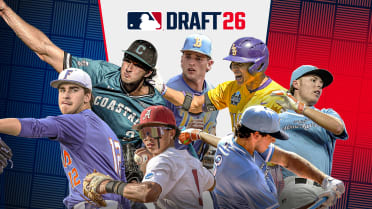
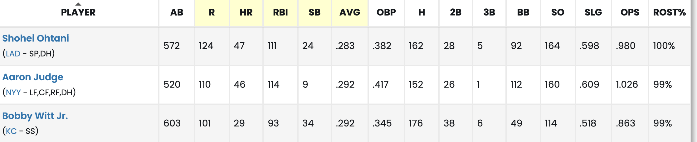
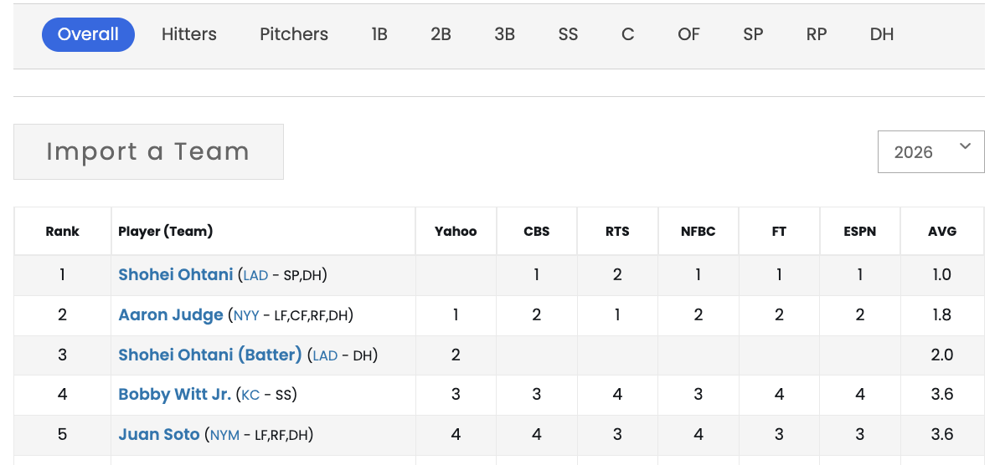
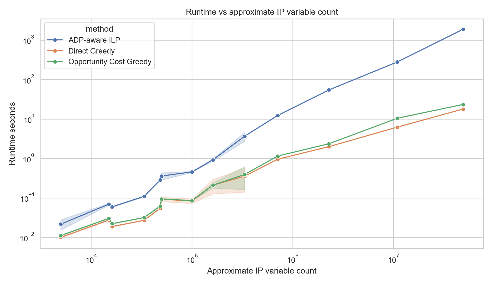

<!-- _class: title-slide -->

# Strategic Fantasy Baseball Draft Optimization
## 棒球制服組的決策支援系統：可擴展的選秀最佳化策略

  <strong>OR114-2 Final Project, Group 4</strong> 
  B13705051 周孟承 | B13902103 鄭宇宏 | B13303153 詹舒宇 | B11705039 李盈盈 
  Spring 2026

---

## 報告大綱 (Outline)

1. **Introduction**：棒球選秀介紹與現代制服組洞察
2. **Problem Description**：蛇形選秀環境與大谷條款
3. **Real Data Collection**：基於 FantasyPros 的真實數據爬取
4. **Model Formulation**：整數線性規劃 (IP) 建模
5. **The Bottleneck**：為何傳統 IP 遇到效能瓶頸？
6. **Algorithms**：機會成本貪婪演算法 (OCG)
7. **Synthetic Data & Evaluation**：合成數據生成與壓力測試
8. **Conclusions**：商業建議與未來展望

---

## 1. Introduction: 棒球建軍的基石 —— 季前選秀

**對於一支職業棒球隊來說，最划算且最重要的補強方式就是「透過選秀」。**

- **什麼是選秀 (The Draft)？**
  在球季開始前，各球隊的總管 (GM) 會齊聚一堂，輪流從龐大的「業餘球員 / 自由球員池」中挑選潛力新秀入隊 — 如何在有限的選秀權 (Picks) 內，精準填補球隊陣容的各個守備位置，並將整體戰力最大化？就是球隊脫穎而出的關鍵。

  

  
<!-- 
講者備註：
各位教授、助教、同學們大家好。想像我們現在是大聯盟球隊的制服組 (Front Office)。對於球隊來說，要在聯盟中保持長期競爭力，最核心的任務就是「選秀」。選秀就像是一場搶物資的遊戲，池子裡的頂級新秀數量有限，當你猶豫不決時，對手就會把人搶走。
-->

---

<!-- _class: impact-slide -->

# Problem Settings

---

## Problem Settings I：球員屬性

在選秀池中，每位球員擁有以下三大屬性：

**1. Projected Value ($v_i$)**：賽季預期貢獻分數  
 

  <h3 style="margin-top:0;">球探數據的收斂</h3>
  各隊對「同一名球員的評價」越來越趨近相同。  
  👉 被量化出來的戰力預測值，直接對應了我們模型中的 Projected Points (預期分數)。

**2. Average Draft Position (ADP)**：市場預期平均被選順位

  <h3 style="margin-top:0;">市場預期的博弈</h3>
  專業團隊知道在某個順位之後，就絕對選不到該球員。  
  👉 這個市場的消耗時機，精準對應了模型中的 ADP (平均選秀順位)。

**3. Eligible Positions ($E_i$)**：球員合法的守備位置。

<!--
> **「當各隊對球員的評價與落點預測都一致時，真正的優勢，在於能否執行一套數學上最佳化的選秀策略！」**
-->

---

## 2. Problem Settings II：蛇形選秀 (Snake Draft)

現實中的 MLB 是依據前一年的戰績（由表現差至優）進行固定順位選秀。但為了探討選秀中純粹 **「策略帶來的優勢」**，我們將此轉為所謂「蛇形選秀」，也是著名選秀遊戲Fantasy Baseball所採用之機制。

- **為什麼使用蛇形選秀？**
  消除初始戰績帶來的絕對資源優勢。在蛇形選秀中，每一輪的選秀順序會反轉（第一輪最後選的人，第二輪第一個選）呈S型次序，藉此凸顯「策略」本身的重要性。
- **數學順位換算公式**：
  假設共有 $M$ 位玩家，我們的初始順位為 $j$ ($1 \le j \le M$)。在第 $r$ 輪時，我們擁有的整體順位 $k$ 為：
  - **奇數輪 (Forward)**：$k = (r - 1)M + j$
  - **偶數輪 (Reverse)**：$k = rM - j + 1$

---

## Problem Settings III：先發陣容需求

要完成一組有效的陣容，必須嚴格滿足以下的數量限制 (Roster Requirements)。
我們使用標準的 **16 人先發名單** 作為基礎架構：

| 守位 (Position) | C | 1B | 2B | 3B | SS | OF | Util | SP | RP |
| :--- | :---: | :---: | :---: | :---: | :---: | :---: | :---: | :---: | :---: |
| **需求人數 (Slots)** | 1 | 1 | 1 | 1 | 1 | 3 | 1 | 5 | 2 |

*註：Util (Utility) 僅限打者，投手無法填補此空缺。這將成為 IP 限制式的重要基準。*

<!--
講者備註：
名單必須嚴格符合這個表。這就產生了有趣的 Trade-off：外野手 (OF) 跟先發投手 (SP) 需要很多人，但游擊手 (SS) 或捕手 (C) 只有一個，如果 SS 的好球員很少，我們是不是該提早搶？這就是我們模型要解決的分配問題。
-->

---

<!-- _class: impact-slide -->

# Real Data Collection
## 將真實世界的棒球市場數據化

---

#### 1. Player projected points $v_i$ 取得
- 從 **FantasyPros** 網站下載 2026 球員預測成績數據 
- 分別套用 Yahoo, FanGraphs 兩種計分方式如下表：

  
Yahoo Scoring

  <ul>
    <li><b>打者</b>：(1B, 2B, 3B, HR, BB, SB, <b>R, RBI</b>) = (2.6, 5.2, 7.8, 10.4, 2.6, 4.2, <b>1.9, 1.9</b>)</li>
    <li><b>投手</b>：(IP, K, SV, H, BB, HBP, <b>W, ER</b>) = (3, 3, 8, -1.3, -1.3, -1.3, <b>8, -3</b>)</li>
  </ul>

  
FanGraphs Scoring

  <ul>
    <li><b>打者</b>：(H, 2B, 3B, HR, BB, SB, <b>AB</b>) = (5.6, 2.9, 5.7, 9.4, 3, 1.9, <b>-1</b>)</li>
    <li><b>投手</b>：(IP, K, SV, H, BB, HBP, <b>HR, HLD</b>) = (7.4, 2, 5, -2.6, -3, -3,  <b>-12.3, 4</b>)</li>
  </ul>

---

#### 2. Average Draft Position (ADP) 取得
- 從 **FantasyPros** 網站下載 2026 球員包括各大平台 (Yahoo, ESPN, CBS, ...) 預測之平均選秀順位

---

<!-- _class: impact-slide -->

# Model Formulation

---

## 4. Model Formulation I：變數與目標函數

有了真實的 $v_i$ 與 $\text{adp}_i$ 後，我們將問題建構為 **Integer Linear Program (IP)**。
令 $I$ 為球員集合，$P$ 為守位集合，$K$ 為我們擁有的選秀籤集合。

**決策變數 (Decision Variables)**：
- $y_i \in \{0,1\}$: 是否將球員 $i$ 選入最終陣容。
- $x_{ip} \in \{0,1\}$: 是否將球員 $i$ 安排在守備位置 $p$。
- $z_{ik} \in \{0,1\}$: 是否在我們的第 $k$ 個順位，選下球員 $i$。

**目標函數 (Objective Function)**：最大化先發名單的總預期分數。
$$ \max \sum_{i \in I} v_i y_i $$

---

## Model Formulation II：核心限制式 (Constraints)

1. **選秀邏輯與名單限制**：
   $$ \sum_{i \in I} z_{ik} = 1 \quad \text{(每個順位選一人)} $$
   $$ \sum_{p \in P} x_{ip} = y_i \quad \text{(球員被選中必給其安排守位)} $$
   $$ \sum_{i \in I} x_{ip} = r_p \quad \text{(滿足各守備位置規定人數)} $$

2. **市場可用性限制 (Market Availability Constraint)**：
   $$ z_{ik} = 0 \quad \text{if } S_k > \text{adp}_i + \delta, \quad \forall i \in I, k \in K $$
   > *如果我們的選秀順位 $S_k$ 已經晚於球員的 $\text{adp}_i + \delta$ (容錯值)，系統將強制無法選取該名球員。*

---

<!-- _class: impact-slide -->

# The Bottleneck
## 為什麼傳統 IP 不夠用？
當學術模型遇上現實世界的資料量

---

## 傳統 IP 的實戰致命傷

雖然我們利用 Gurobi 解出的 IP 能給出**絕對完美的最佳解**，但在現實中會面臨極大的挑戰：

  
Scalability Crisis

  <h3 style="margin-top:0;">指數爆炸的可擴展性</h3>
  棒球選秀的母體池極其龐大，大聯盟加上無數新秀，球員池高達十幾萬人。當球員數 ($n$) 放大，ip 的 Branch-and-Bound 搜尋空間會呈指數爆炸。

  
Real-time execution

  <h3 style="margin-top:0;">實戰的時間壓力</h3>
  選秀是有時間限制的。總管不可能在選秀室等 Gurobi 跑半個小時甚至超過。在巨大規模下，IP 會直接 超時 或 記憶體耗盡 (MLE)。

---

## 6. Algorithms：啟發式演算法設計 (Heuristics)

為了解決 IP 的效能瓶頸，我們設計了兩種啟發式演算法 (Heuristics)。

### ❌ Baseline: Direct Greedy (直接貪婪法)
- **邏輯**：每次輪到我選時，計算當下各守位之「稀缺度」並選擇最大者，再選下該位最強球員。
  - **稀缺度之判定**：$\max_{p} \left( \frac{\text{該守位待補人數}}{\text{市場剩餘可用球員}} \right)$
- **缺點**：因為不考慮未來，為了一個替補游擊手，可能因此放掉錯失一千載難逢的超級巨星。

<!--
講者備註：
Direct Greedy 就像是一般的休閒玩家，只看現在缺什麼就補什麼。這很快，但非常容易在後面吃虧，因為他完全沒有考慮到「機會成本」。
-->

---

## Algorithms: Opportunity Cost Greedy (OCG)
如何將策略及演算法的視野拉遠？

- **核心概念**：套入經濟學概念，計算「等待的代價 (Delay-Cost)」。
- **決策流程**：
  1. 檢視目前球隊所有缺人的守位。
  2. 找出該守位**現在能選到**的最強球員 ($V_{\text{now}}$)。
  3. 預測到**我們下一輪選秀時**，該守位還剩下的最強球員 ($V_{\text{next}}$)。
  4. 計算**機會成本**： $\text{Score} = V_{\text{now}} - V_{\text{next}}$
  5. 優先選擇機會成本（損失）最大的守位與球員。

> OCG 保證了策略在具時間序列之數據下依然有效！

---

## Algorithms: 時間複雜度分析 (Time Complexity)

- **實作方式 (Data Structure)**：
  - 為每個守備位置維護一個 **Max-Heap (優先佇列)**。
  - 採用 **Lazy Deletion (延遲刪除)**：當球員被對手選走時不立刻重整 Heap，而是等到 pop 時再檢查有效性。
- **複雜度表現**：
  - 假設 $n$ = 球員總數， $r$ = 名單人數， $p$ = 守備位置數。
  - **總時間複雜度**：$\mathcal{O}(n \log n + r \cdot p)$ (Direct Greedy 亦同)

  數學保證 OCG 能以接近線性的時間，瞬間處理大規模人數的選秀池。

---

## ：Real-Data Validation

| 數據來源 (2026) | 演算法 | **Optimal Gap Ratio** |
| :--- | :--- | :--- |
| **Yahoo** | **OCG (我們的)** | **0.50%** |
| | Direct Greedy | 3.24% |
| **FanGraphs** | **OCG (我們的)** | **1.24%** |
| | Direct Greedy | 3.36% |

---

<!-- _class: impact-slide -->

# Synthetic Data & Evaluation
## 我們如何證明演算法在極端環境下依然有效？

---

## Synthetic Data 的四大變因

真實數據只能證明「當下」有效。合成數據讓我們檢驗更多極端情境，並在策略設計上找到最具差異性的測試維度

  
Factor 1

  <strong>Points Distribution</strong> 
  從平均型到巨星集中，觀察價值曲線的影響。

  
Factor 2

  <strong>Positions Distribution</strong> 
  從高彈性工具人到嚴格單一守位。

  
Factor 3

  <strong>Market Volatility</strong> 
  測試 ADP 噪音與容錯空間的穩定度。

  
Factor 4

  <strong>Scale & Demand</strong> 
  檢驗稀缺市場與供給過多對策略的影響。

> **實驗指標**：Optimal Gap Ratio = $\frac{Z_{\text{IP}} - Z_{\text{Heuristic}}}{Z_{\text{IP}}} \times 100\%$。

---

## Synthetic Data: Scenario Matrix

| ID | Main Factor | Demand Ratio ($D$) | Points Dist. ($v_i$) | Pos. Dist. ($E_i$) | ADP Noise ($\delta, \sigma$) |
| :--- | :--- | :---: | :--- | :--- | :--- |
| S1 | **Baseline** | 3 | Normal | Roster-Ratio | (0, 30) |
| S2 | Points: Uniform | 3 | **Uniform** | Roster-Ratio | (0, 30) |
| S3 | Points: Star-Heavy | 3 | **High-Low** | Roster-Ratio | (0, 30) |
| S4 | Pos: Uniform-by-Type | 3 | Normal | **Uniform-by-Type** | (0, 30) |
| S5 | Pos: Point-Flexible | 3 | Normal | **Point-Flexible** | (0, 30) |
| S6 | Pos: Single-Position | 3 | Normal | **Single-Position** | (0, 30) |
| S7 | Market: Efficient | 3 | Normal | Roster-Ratio | **(0, 0)** |
| S8 | Market: Mild Noise | 3 | Normal | Roster-Ratio | **(0, 60)** |
| S9, 10 | Market: Chaotic | 3 | Normal | Roster-Ratio | **(±5, 30)** |
| S11, 12 | Market: Chaotic | 3 | Normal | Roster-Ratio | **(±10, 30)** |
| S13 | Load (High) | **1** | Normal | Roster-Ratio | (0, 30) |
| S14 | Load (Low) | **3** | Normal | Roster-Ratio | (0, 30) |
| S15 | Load (Ultra-Low) | **10** | Normal | Roster-Ratio | (0, 30) |

---

## Strategic Insights: OCG 的最大獲益場景

OCG 對以下幾種極端場景的改善最明顯：

- **S3 / High-Low**：價值曲線高度不平衡，DG 會錯失關鍵巨星；OCG 將 gap 由 8.39% 降到 2.87%。
- **S6 / Single-Position**：由於球員守位限制，OCG 能避免早期選秀錯誤被後線放大。
- **S13 / D=1 (極度稀缺)**：市場供給緊繃時，OCG 仍能提早佈局，保住整體陣容價值。
- **S8-S12 / Chaotic Market**：ADP 噪音與容錯改變時，OCG 表現更穩定，適合高不確定性環境。

| Scenario | DG Gap | OCG Gap | Key Benefit |
| :--- | :---: | :---: | :--- |
| High-Low | 8.39% | 2.87% | 穩住頂級球員 |
| Single-Position | 5.11% | 0.94% | 避免守位枯竭 |
| D=1 | 8.81% | 2.64% | 極度稀缺下仍可預判 |
| Chaotic Market | 5.56% / 5.42% | 2.43% / 1.72% | 高不確定性下更穩定 |

---

## Stress Testing: Runtime Comparison
| Stress Level | Approx. Vars | IP Runtime | OCG Runtime |
| :--- | ---: | :--- | :---: |
| small | 334,080 | 4.23 s  | 0.85 s |
| large | 2,289,600 | 54.26 s  | 2.34 s |
| timeout | 49,029,120 | 30 mins timeout | 23.28 s |

**結論**：在運算量增大，造成 IP 超時的情況下，我們設計的OCG演算法之運算時間仍趨近線性成長，在高維度之選秀市場中更有其實用性。

<!-- i don't know why but 他的排版有點醜。 -->
---
## 8. Conclusions & Business Recommendations

**給球隊總管 (GM) 的最終建議：**

1. **傳統的「選最好球員 (BPA)」策略已經過時**：
   不考慮機會成本的貪婪選秀可能會讓球隊流失極大的預期戰力。
2. **完美最佳化 (IP) 不具備實戰操作性**：
   選秀有時間限制。當考量全聯盟農場與潛力新秀時，指數爆炸的 IP 較難作為 Real-time 輔助工具。
3. **導入 Opportunity Cost Greedy (OCG) 系統**：
   OCG 成功捕捉了 IP 的策略精髓（預判未來），將最佳化落差控制在極小範圍，且擁有應付五千萬級變數的即時運算能力。

---

## Limitations & Future Extensions

我們未來的系統升級方向：

- **對手行為的機率模型 (Probabilistic Opponent Modeling)**：
  - 目前 ADP 只是一個確定性指標 (Deterministic)。未來可加入對手偏好（如：傾向選本土球員、特定球隊迷）的機率分佈。
- **結合蒙地卡羅模擬 (Monte Carlo Simulations)**：
  - 球員的預測分數帶有變異數（如受傷風險、低潮風險）。未來目標是將 OCG 升級為能處理變異數風險的 AI 決策系統。

---

<!-- _class: title-slide -->
# Thank You for Listening!

  <strong>OR114-2 Final Project, Group 4</strong> 
  B13705051 周孟承 | B13902103 鄭宇宏 | B13303153 詹舒宇 | B11705039 李盈盈 

